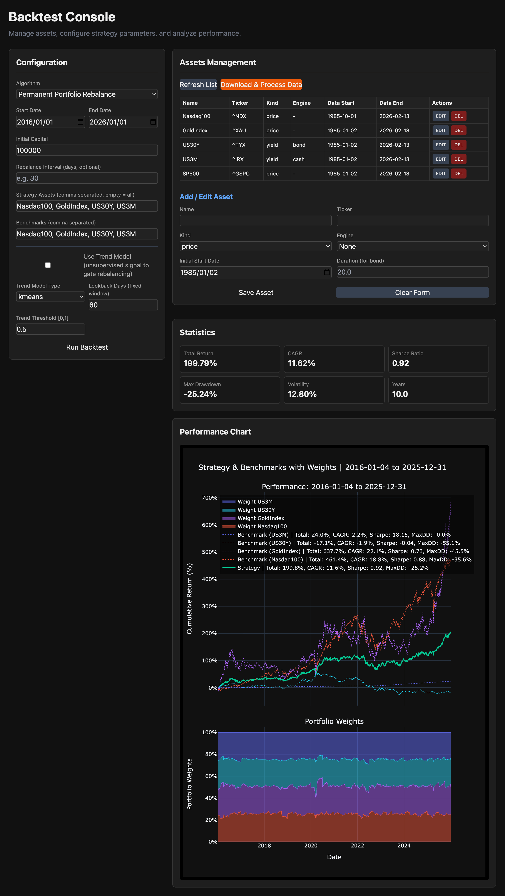

# TrendAlloc — Multi-Asset Backtest System

A Python-based multi-asset backtesting framework featuring automated data downloading, yield-to-price pricing engines, a pluggable rebalancing algorithm interface, optional ML-based trend models, and an interactive FastAPI web console.

Designed for long-term asset allocation research (e.g., momentum-based, volatility-scaled, or permanent portfolio strategies) with support for arbitrary asset configurations.

---

<details>
<summary><strong>Changelog</strong></summary>

- **2026-03-03**
  - Fixed a JavaScript scoping bug in `ui.html`: the `DOMContentLoaded` callback was never closed, causing all UI handler functions (`loadAssets`, `saveAsset`, `downloadAssets`, `processAssets`, `runBacktest`) to be defined in an unreachable scope. The asset list was permanently empty.
  - Standardised CSV format across all three downloaders to `Date,Open,High,Low,Close,Volume` (Date as index, exactly 5 data columns). AkShare and Baostock `_normalise()` now explicitly drop any extra columns (e.g. Chinese-named trading columns).
  - Fixed a critical Yahoo downloader data-corruption bug: `reset_index()` + `to_csv(index=False)` caused the `Date` column to be written as the last column. On the next incremental run only 2–3 rows were preserved. Fixed by removing `reset_index()` and using `to_csv(index=True)`.
  - Added legacy CSV format compatibility to all three `_get_existing_data` methods so that files written in the old broken format are automatically normalised on the next load.
  - Fixed data-loss safety order in all three downloaders: the overlap row (last row of old data) is now only removed **after** a successful download. Previously it was removed before the download, so a network failure could permanently destroy the most recent data point.
  - Added `NaT` index filtering, deduplication, and sort in `data_processor.py` (`_load_raw`, `build_aligned_dataframe`) and `backtest_engine.py` (`_load_data`) to prevent `'Value based partial slicing on non-monotonic DatetimeIndexes'` errors caused by trailing empty rows written by some download paths.
  - Expanded `_BS_UNSUPPORTED` blocklist in `baostock_downloader.py` with tickers not available in the Baostock database: `931722` (港股通央企红利), `932000` (CSI 2000), `H30269` (CSI Dividend Low-Vol), `H30533` (China Internet 50).
  - Added `baostock_downloader.py` to the data loader layer (Baostock A-share incremental downloader).
  - Download UI split-button now exposes four modes: **Auto** (smart routing by `source` field), **Yahoo**, **AkShare**, **Baostock** — enabling forced source override per session.
  - Added `GET /api/trend_models`, `GET /api/configs/best`, `GET /api/configs/best/{filename}`, `POST /api/configs/best` endpoints.

- **2026-03-02**
  - Decoupled all trading logic from `BacktestEngine`: the engine now only handles the time loop and bookkeeping. Every rebalance decision is fully delegated to a user-supplied `rebalance_fn(ctx: RebalanceContext) -> RebalanceResult`.
  - Introduced `RebalanceContext` and `RebalanceResult` dataclasses as the v2 interface contract between the engine and strategy functions.
  - Fixed `BacktestConfig` default algorithm and engine fallback to consistently use `permanent_portfolio_rebalance` (equal-weight).
  - Fixed `Max Recovery Days` metric — previous implementation measured time spent at a peak level rather than the actual drawdown recovery period.
  - Made benchmark column for Alpha/Beta calculation dynamic (uses `benchmark_cols[0]` from config instead of a hardcoded `"SP500"`).
  - Fixed a mutation bug where appending safe assets to `candidate_assets` would silently modify the original Pydantic request object.
  - Added `predict_score` and `predict_latest_score_from_matrix` to `RandomForestTrendModel`, completing the interface required by the engine's model dispatch chain.
  - Removed phantom model types (`autoencoder`, `hmm`) from `BacktestConfig` documentation — these had no implementation.
  - Updated public template files (`algorithms_template.py`, `trend_models_template.py`) to reflect the v2 interface, with clear extension guides for contributors.

- **2026-02-28**
  - Integrated PyTorch-based MLP trend models (`torch_mlp`) into the backtest engine and UI.
  - Added dynamic Risk Leverage controls for smooth transitions between risk and safe asset buckets based on the trend model's probability score.
  - Added automatic saving of backtest configurations to YAML files in `data_processed/configs/` for reproducibility.

- **2026-02-22**
  - Added public template files for `algorithms.py` and `trend_models.py`.
  - Cleaned up `.gitignore` rules for correct handling of `config/assets.json`.

- **2026-02-18**
  - Refactored the data pipeline into incremental download (per asset) and full-portfolio alignment stages.
  - Introduced `DataProcessor` with `bond_pricing_engine` and `cash_pricing_engine` for yield-to-price conversion.
  - Updated FastAPI endpoints: `POST /api/assets/download` operates on selected assets; `POST /api/assets/process` always rebuilds `aligned_assets.csv` from all configured assets.

- **2026-02-17**
  - Added trend model UI controls (model type, lookback window, threshold).
  - Enhanced the performance chart with Total Return, CAGR, Sharpe, and Max Drawdown for strategy and all benchmarks.
  - Added a stacked area subplot showing portfolio asset weights over time.

</details>

---

## Project Structure

```text
project_root/
├── backend/
│   ├── api.py              # FastAPI app and interactive Web UI (/ui)
│   ├── service.py          # BacktestConfig / BacktestResult models and job orchestration
│   └── assets_config.py    # Asset configuration manager (config/assets.json)
│
├── data/                   # Raw per-asset CSV files (named by sanitized asset name)
├── data_processed/
│   ├── aligned_assets.csv  # Global aligned price matrix (all configured assets)
│   ├── configs/            # Saved backtest configuration YAML files
│   └── backtest_results.html  # Latest Plotly performance chart
│
├── data_loader/
│   ├── yahoo_downloader.py    # Incremental OHLCV downloader (yfinance)
│   ├── akshare_downloader.py  # Incremental OHLCV downloader (akshare, A-share / HK assets)
│   ├── baostock_downloader.py # Incremental OHLCV downloader (baostock, A-share securities)
│   └── data_processor.py     # Yield-to-price engines and multi-asset alignment
│
├── strategies/
│   ├── backtest_engine.py       # Core simulation engine: time loop + bookkeeping only
│   ├── algorithms_template.py   # Public template: how to write a custom rebalance function
│   └── trend_models_template.py # Public template: how to implement a custom trend model
│
├── utils/
│   ├── decorators.py   # Generic decorators (e.g., @retry)
│   ├── naming.py       # Asset name sanitization helpers
│   └── tools.py        # Timezone and date utility functions
│
├── config/
│   └── assets.json     # Asset universe configuration
│
├── logger.py           # Global logging configuration
├── main_download.py    # CLI entry point: data download and alignment
├── main_backtest.py    # CLI entry point: backtest execution
├── requirements.txt
└── README.md
```

> **Note:** `strategies/algorithms.py` and `strategies/trend_models.py` are symlinks to
> `.private_data/` and are not tracked by Git. Use the `*_template.py` files as
> the public reference for the interface contracts.

---

## Architecture

### Rebalance Interface (v2)

The engine and strategy are fully decoupled via two dataclasses:

```python
# Engine → Strategy
@dataclass
class RebalanceContext:
    current_units: np.ndarray   # units currently held  (n_assets,)
    today_prices: np.ndarray    # prices today           (n_assets,)
    cash_balance: float         # uninvested cash
    fees: float                 # transaction fee rate
    price_window: np.ndarray    # price history [lookback, n_assets]
    returns_window: np.ndarray  # return history [lookback, n_assets]
    trend_score: float          # ML model score ∈ [0,1]  (1.0 = no model)
    model_threshold: float      # score threshold for safe-asset switch
    top_k: int                  # max assets to hold simultaneously
    target_volatility: float    # annualised vol target
    max_leverage: float         # hard cap on gross exposure
    max_asset_weight: float     # hard cap per single asset (e.g. 0.30 = 30%)
    vol_scale_lookback: int     # short window for vol scaling; 0 = use full vol_lookback
    momentum_threshold: float   # min cumulative return to pass absolute-momentum filter
    use_sharpe_weighting: bool  # if True, weight ∝ Sharpe-proxy instead of raw return
    safe_asset_indices: List[int]
    col_names: List[str]

# Strategy → Engine
@dataclass
class RebalanceResult:
    new_units: np.ndarray  # target units after rebalance
    new_cash: float        # remaining cash after trades & fees
```

`BacktestEngine` handles only the time loop, data windowing, ML score computation, and bookkeeping. **All trading decisions live inside `rebalance_fn`.**

### Trend Model Interface

The engine discovers the right method via `hasattr` in the following priority order:

1. `predict_latest_score_from_matrix(matrix)` — preferred; receives full `[lookback, n_cols]` price matrix
2. `predict_latest_score_from_series(close, us3m, us30y)` — single-asset signal models
3. `predict_score(window_features)` — raw feature vector fallback

---

## Module Functionality

### `backend/service.py` — BacktestService

- **Algorithm Discovery**: Automatically discovers every `@staticmethod` whose name ends with `_rebalance` inside `RebalanceAlgorithms` via `inspect.getmembers`.
- **Job Orchestration**: Resolves paths, instantiates `BacktestEngine`, and wraps results into `BacktestResult`.
- **Key Config Fields** (`BacktestConfig`):
  - `algorithm` — rebalance function name (default: `permanent_portfolio_rebalance`)
  - `benchmark_cols` — benchmarks for chart and Alpha/Beta calculation (first entry is used for stats)
  - `use_trend_model` / `trend_model_type` / `model_path` — optional ML trend overlay
  - `top_k`, `target_volatility`, `max_leverage`, `safe_assets` — passed to `RebalanceContext`
  - `max_asset_weight` — per-asset weight cap; excess is redistributed among other selected assets
  - `vol_scale_lookback` — short trailing window for vol estimation in the scaling layer; `0` = use `vol_lookback`
  - `momentum_threshold` — minimum cumulative return required for an asset to pass the absolute-momentum filter
  - `use_sharpe_weighting` — if `True`, allocation weights are proportional to Sharpe-proxy (return / vol)

### `backend/api.py` — REST Endpoints

| Method | Endpoint | Description |
|--------|----------|-------------|
| `GET` | `/api/algorithms` | List auto-discovered rebalance strategies |
| `GET` | `/api/trend_models` | List available persisted model files (`.pkl` / `.pt`) |
| `GET` | `/api/assets` | List configured assets with local data status |
| `POST` | `/api/assets` | Create an asset configuration |
| `PUT` | `/api/assets/{name}` | Update an asset configuration |
| `DELETE` | `/api/assets/{name}` | Delete an asset configuration |
| `POST` | `/api/assets/download` | Incremental download for selected assets (60 s cooldown); supports forced source override (Auto / Yahoo / AkShare / Baostock) |
| `POST` | `/api/assets/process` | Rebuild `aligned_assets.csv` from all configured assets; auto-derives `TermSpread` column when both `US30Y` and `US3M` are present |
| `POST` | `/api/backtest` | Run a backtest and return stats + chart URL |
| `GET` | `/api/configs/best` | List all saved best-config YAML files |
| `GET` | `/api/configs/best/{filename}` | Load and return a specific saved config |
| `POST` | `/api/configs/best` | Save the current backtest config as a YAML file |

### `data_loader/data_processor.py` — DataProcessor

- **`bond_pricing_engine`**: Converts a yield series to a synthetic total-return price series using a duration-based approximation.
- **`cash_pricing_engine`**: Converts a short-rate yield series to a cumulative cash return series.
- **Alignment**: Builds the price matrix with `dropna(how="all")`, preserving partial-data dates. Final trimming is deferred to the backtest layer.
- **`TermSpread` derivation**: When both `US30Y` and `US3M` columns are present in the aligned file, a `TermSpread` column (US30Y − US3M, in yield space) is automatically appended.

### `data_loader/` — Incremental Downloaders

All three downloaders follow the same safety contract:

1. **Load** existing CSV (full).
2. **Download** new data from the remote source.
3. Only if the download succeeds: **remove the last row** of the old data (overlap row) → **merge** → **save**.

This guarantees that a network failure never corrupts the existing data.

**CSV format**: All downloaders write and read `Date,Open,High,Low,Close,Volume` — `Date` as the index (first column), exactly 5 data columns.

| Downloader | Source | Asset types |
|------------|--------|-------------|
| `yahoo_downloader.py` | Yahoo Finance (`yfinance`) | Global ETFs, indices, futures |
| `akshare_downloader.py` | AkShare | A-share indices (`akshare_index`), ETFs (`akshare_etf`), gold (`akshare_gold`), HK indices (`akshare_hk_index`) |
| `baostock_downloader.py` | Baostock | A-share securities (`baostock`); tickers in `_BS_UNSUPPORTED` are silently skipped |

---

## Installation

### 1. Create Virtual Environment (Recommended)

```bash
python -m venv .venv
source .venv/bin/activate  # Windows: .venv\Scripts\activate
```

### 2. Install Dependencies

```bash
pip install -r requirements.txt
```

---

## Usage Guide

### 1. Data Setup

1. Configure assets via the Web UI (**Assets Management** tab) or by editing `config/assets.json` directly.
2. Download raw data:

   ```bash
   python main_download.py
   # or via Web UI → select assets → Download Data
   ```

3. Process and align data:

   ```bash
   # Via Web UI → Process Data
   # (always rebuilds aligned_assets.csv from all assets in config/assets.json)
   ```

### 2. Running a Backtest

#### Via Web UI

```bash
python backend/api.py
# open http://127.0.0.1:8000/ui
```

Configure parameters and click **Run Backtest**.



#### Via CLI

```bash
python main_backtest.py
```

### 3. Adding a Custom Strategy

Create a static method ending in `_rebalance` in `strategies/algorithms.py`. It will be auto-discovered and appear in the UI dropdown immediately on next server start.

See `strategies/algorithms_template.py` for the full interface specification and a runnable example stub.

```python
from strategies.algorithms import RebalanceAlgorithms, RebalanceContext, RebalanceResult

class MyAlgorithms:
    @staticmethod
    def my_strategy_rebalance(ctx: RebalanceContext) -> RebalanceResult:
        # ... your logic here ...
        return RebalanceAlgorithms.permanent_portfolio_rebalance(ctx)  # delegate or replace
```

### 4. Adding a Custom Trend Model

Subclass `TrendModelBase` in `strategies/trend_models.py` and implement at least `predict_score`. For full matrix input, also implement `predict_latest_score_from_matrix`.

See `strategies/trend_models_template.py` for the interface contract and a minimal example.

---

## FAQ

- **Rate Limiting**: The Yahoo Finance downloader is subject to API rate limits. The system enforces a 60-second cooldown on the `POST /api/assets/download` endpoint.
- **`Download Data` vs `Process Data`**:
  - `Download Data` operates only on the assets you have selected in the UI. The split-button lets you force a specific source (Auto / Yahoo / AkShare / Baostock).
  - `Process Data` always rebuilds `aligned_assets.csv` from *all* assets defined in `config/assets.json`.
- **`algorithms.py` not found**: The file is a symlink to `.private_data/algorithms.py` and is not tracked by Git. Use `strategies/algorithms_template.py` as a starting point and place your implementation in `.private_data/algorithms.py`.
- **Supported Trend Model Types**: `kmeans_simple`, `kmeans_window`, `random_forest`, `torch_mlp`.
- **CSV format**: All raw per-asset files under `data/` use the format `Date,Open,High,Low,Close,Volume` with `Date` as the row index. Files in the old format (Date as last column) are automatically normalised on the next incremental download.
- **Baostock limitations**: Tickers for HK-connect indices, very new indices, or custom cross-border indices may not be available in Baostock's database. These are listed in `_BS_UNSUPPORTED` in `baostock_downloader.py` and will be skipped with a warning; use Yahoo Finance or AkShare for those assets instead.
